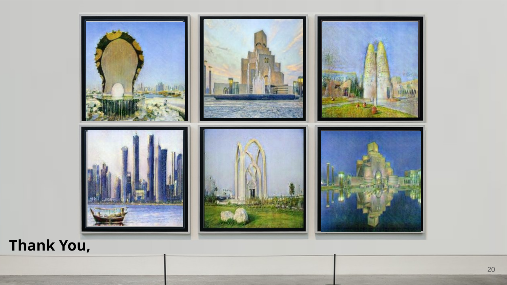
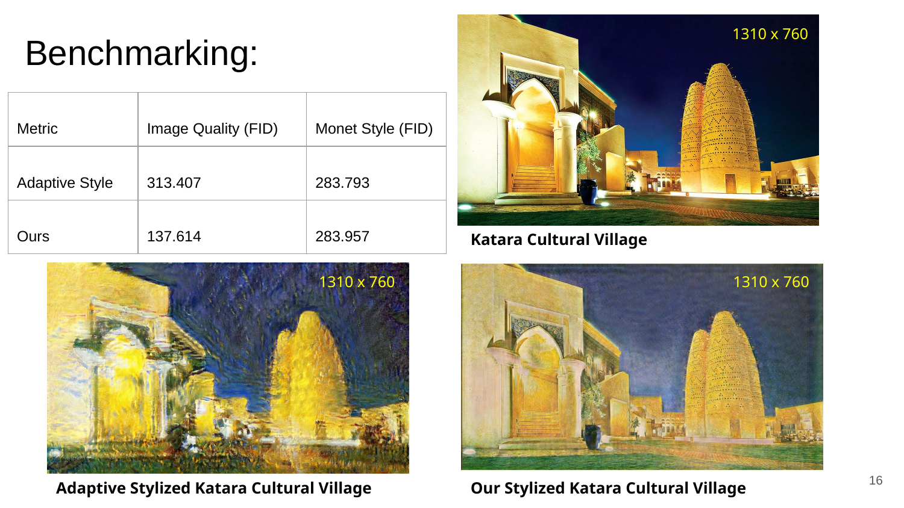

# Qatar-to-Monet: CycleGAN Image Style Transfer

A 2020 graduate course project exploring **unpaired image-to-image translation** for transforming photographs of Qatar landmarks into Claude Monet-inspired artwork.

The project adapts the TensorFlow CycleGAN tutorial and experiments with a **ResNet-based generator**, Fréchet Inception Distance (FID) benchmarking, qualitative content-preservation analysis, and super-resolution post-processing.



## Project objective

The project asks: **How might Monet have rendered scenes from Qatar?**

Because paired photographs and Monet paintings of the same locations do not exist, the task was formulated as unpaired image translation using CycleGAN. The workflow was tested on landmarks and cultural scenes including Katara Cultural Village, Doha Corniche, Banana Island, and Qatar National Day imagery.

## What was implemented

- Adaptation of a TensorFlow CycleGAN workflow for Photo-to-Monet translation
- ResNet-based generator experiments
- Image preprocessing and augmentation for 256 × 256 inputs
- Adversarial, cycle-consistency, and identity losses
- Learning-rate experiments and manual output inspection
- FID-based quantitative evaluation
- Comparison with a tested Pix2Pix-based baseline
- Comparison with an adaptive style-transfer model
- Super-resolution post-processing for selected outputs
- Exploratory high-resolution image and video stylization

## Dataset

The project used the `monet2photo` dataset distributed through TensorFlow Datasets:

| Split | Images |
|---|---:|
| Monet training | 1,072 |
| Monet testing | 121 |
| Photo training | 6,287 |
| Photo testing | 751 |

All model inputs were processed at 256 × 256 resolution.

## Model overview

CycleGAN learns two mappings:

- Photo → Monet
- Monet → Photo

Two discriminators evaluate realism in each domain. Cycle consistency encourages the translated image to preserve the original scene, while identity loss helps retain relevant color and structural information.

## Results from the original project

### Baseline comparison

| Model | FID on 751 test images | Average training time |
|---|---:|---:|
| Tested Pix2Pix-based baseline | 93.587 | 15 min/epoch |
| ResNet CycleGAN experiment | **91.478** | **7 min/epoch** |


### Visual comparison

The project examined whether outputs captured Monet-like color and light while preserving scene content.


### Qatar landmark example



### Super-resolution experiment

A pretrained image super-resolution model was used to upscale selected 256 × 256 stylized outputs to 1024 × 1024.


## Repository structure

```text
qatar-to-monet-cyclegan/
├── README.md
├── notebooks/
│   └── Photo2Monet_resnet.ipynb
├── presentation/
│   └── Qatar_to_Monet_Project_Presentation.pdf
├── assets/
│   ├── baseline_comparison.png
│   ├── adaptive_style_comparison.png
│   ├── katara_comparison.png
│   ├── super_resolution_example.png
│   └── gallery.png
├── requirements.txt
├── NOTICE.md
├── LICENSE
└── .gitignore
```

## Running the notebook

The notebook was created in Google Colab in 2020 and depends on older TensorFlow ecosystem packages. It is preserved here as the original project artifact and may require dependency updates to run in a current environment.

A typical setup requires:

```bash
pip install tensorflow tensorflow-datasets tensorflow-addons matplotlib numpy
pip install git+https://github.com/tensorflow/examples.git
```

The original workflow also mounts Google Drive for checkpoints and generated outputs. Update those paths before running.

## Technologies

Python · TensorFlow · TensorFlow Datasets · TensorFlow Addons · CycleGAN · ResNet · Generative Adversarial Networks · FID · Image Super-Resolution

## Authors

- Rayyan Ahmed
- Noha M. Barhom

Graduate course project for *AI Technologies for Multimedia Applications*, 2020.

## Attribution

The notebook builds on the TensorFlow CycleGAN tutorial and TensorFlow Examples code. See [NOTICE.md](NOTICE.md) and [LICENSE](LICENSE) for attribution and licensing information.
