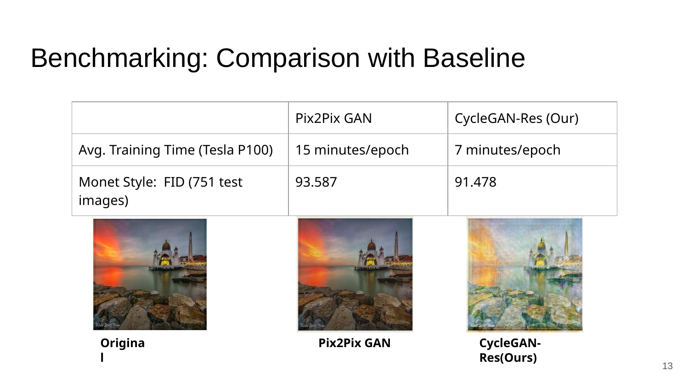

# Qatar-to-Monet: CycleGAN Image Style Transfer

A 2020 graduate course project exploring **unpaired image-to-image translation** for transforming photographs of Qatar landmarks and cultural scenes into Claude Monet-inspired artwork.

The project adapted the TensorFlow CycleGAN workflow, tested a **ResNet-based generator**, benchmarked image quality using Fréchet Inception Distance (FID), compared the model with alternative style-transfer approaches, and explored high-resolution image and video stylization.


## Project question

**How might Claude Monet have rendered scenes from Qatar?**

The project connected generative image modeling with Qatar's cultural landscape. It examined whether an image-translation model could preserve the identity and structure of local landmarks while transferring Monet-like characteristics such as:

- emphasis on light, color, texture, and brushstroke;
- reduced reliance on hard outlines;
- use of color patches and soft forms;
- variation in object appearance according to lighting conditions.

Potential applications considered in the original project included:

- stylized visual content featuring Qatar landmarks;
- art creation and cultural storytelling;
- high-resolution visual production;
- video stylization;
- museum and creative-media experiences.

## Qatar context

The project was framed around Qatar landmarks and cultural scenes, including:

- Museum of Islamic Art;
- Katara Cultural Village;
- Doha Corniche;
- Banana Island;
- Qatar National Day imagery.

The concept was also linked to Qatar's broader cultural-development goals by exploring how artificial intelligence could support digital art and cultural representation.

## Related approaches reviewed

The project reviewed three main families of style-transfer methods:

1. **Neural style transfer** — combines the content of one image with the style statistics of another.
2. **Unpaired image-to-image translation** — learns mappings between two visual domains without requiring corresponding image pairs.
3. **Adaptive style transfer** — applies a learned or pretrained style representation to new content images.

CycleGAN was selected because the available photo and Monet datasets were **unpaired**. There were no Monet paintings and modern photographs depicting the exact same scenes or layouts.

## Dataset

The project used the `monet2photo` dataset:

| Domain and split | Number of images |
|---|---:|
| Monet training images | 1,072 |
| Monet testing images | 121 |
| Photo training images | 6,287 |
| Photo testing images | 751 |

Images were processed at **256 × 256** resolution for model training and evaluation.

The two domains contain independent images rather than matched pairs. This makes cycle consistency important for preserving the content of the source photograph after style translation.

## Model architecture

CycleGAN learns two mappings:

- **Photo → Monet**
- **Monet → Photo**

It uses:

- two generators;
- two discriminators;
- adversarial objectives for domain realism;
- cycle-consistency loss for content preservation;
- identity loss to reduce unnecessary changes when an image already belongs to the target domain.

### ResNet generator

The project tested a ResNet-based generator rather than relying only on a U-Net-style mapping. Residual blocks were used to preserve scene content while allowing the network to transform texture, color, and visual style.

The two-generator cycle helps prevent the Photo-to-Monet model from ignoring the original scene. A translated image is mapped back to the photo domain, and the reconstruction is compared with the source image.

## Training workflow

The experimental workflow included:

1. loading the Photo and Monet domains;
2. resizing, cropping, normalization, and augmentation;
3. training both generators and discriminators;
4. monitoring adversarial, cycle-consistency, and identity objectives;
5. testing learning-rate settings;
6. visually inspecting generated results;
7. calculating FID on generated and real-image distributions;
8. comparing model variants and alternative approaches;
9. applying selected outputs to Qatar scenes;
10. testing super-resolution and video-stylization workflows.

## Evaluation criteria

### Qualitative evaluation

Outputs were visually assessed for:

- preservation of scene content;
- Monet-like treatment of light and color;
- reduced hard edges;
- smoother brushstroke-like texture;
- preservation of landmark structure;
- consistency across different lighting conditions.

### Quantitative evaluation

The project used **Fréchet Inception Distance (FID)**. Features are extracted using an Inception network, represented with multivariate Gaussian distributions, and compared using their means and covariance matrices. Lower FID indicates closer similarity between generated images and the target image distribution.

The project also compared:

- training time per epoch;
- inference time per image;
- image-quality FID;
- style-oriented FID;
- visual content preservation.

## Baseline comparison

The ResNet CycleGAN experiment was compared with a tested Pix2Pix-based baseline.

| Model | Monet-style FID on 751 test images | Average training time |
|---|---:|---:|
| Tested Pix2Pix-based baseline | 93.587 | 15 min/epoch |
| ResNet CycleGAN experiment | **91.478** | **7 min/epoch** |

The ResNet CycleGAN produced a lower FID in the reported experiment while reducing the measured average training time per epoch.



## Comparison with an adaptive style-transfer model

The project also compared the CycleGAN output with a pretrained adaptive style-transfer approach.

The comparison focused on:

- capturing light through color;
- maintaining scene content;
- preserving the source of light;
- producing smoother brushstroke-like visual patterns;
- inference speed.

| Method | Reported single-image inference time |
|---|---:|
| Adaptive style-transfer model | 84 seconds |
| ResNet CycleGAN experiment | **0.822 seconds** |

These values reflect the original 2020 experimental environment and hardware.


## Qatar-scene experiments

The trained model was applied to multiple Qatar scenes to assess whether it could preserve recognizable local content while transferring the Monet domain.

### Katara Cultural Village

The Katara experiment compared the source image, adaptive style-transfer output, and CycleGAN output.

| Method | Image-quality FID | Monet-style FID |
|---|---:|---:|
| Adaptive style | 313.407 | 283.793 |
| ResNet CycleGAN experiment | **137.614** | 283.957 |

The quantitative evaluation used 13 high-resolution images for image-quality analysis and a 300-image test set for style-oriented comparison.


### Other tested scenes

The presentation also included examples from:

- Qatar National Day Parade imagery;
- Museum of Islamic Art;
- Doha Corniche;
- Banana Island.

## High-resolution image stylization

The original CycleGAN output resolution was 256 × 256. Two high-resolution workflows were examined:

1. applying the trained model within a high-resolution processing workflow;
2. stylizing a low-resolution image and then using a pretrained image super-resolution model to upscale the result.

A selected Doha Corniche output was increased from **256 × 256 to 1024 × 1024** using pretrained image super-resolution.


## Video stylization

The project also explored a high-resolution video-stylization pipeline. Video frames could be processed through the trained style-transfer model and then enhanced using the same super-resolution approach.

This was an exploratory extension rather than the primary model benchmark.

## Main findings

The original experiments indicated that:

- unpaired translation was suitable for the available Photo and Monet domains;
- the ResNet generator preserved scene content while transferring visual texture and color;
- the tested ResNet CycleGAN achieved a modest FID improvement over the reported baseline;
- training and inference were faster in the reported experimental comparisons;
- Qatar landmarks remained recognizable after stylization;
- super-resolution provided a practical route from 256 × 256 model outputs to larger visual assets.

## Limitations

- The project was completed in 2020 using the software and hardware available at that time.
- The notebook depends on older TensorFlow packages and may require updates.
- FID values should be interpreted within the exact dataset, preprocessing, and implementation used in the project.
- Visual style and content preservation were partly assessed through manual inspection.
- Video stylization and high-resolution generation were exploratory extensions.
- The implementation predates modern diffusion-based image-generation systems.

## Repository structure

```text
qatar-to-monet-cyclegan/
├── README.md
├── notebooks/
│   └── Photo2Monet_resnet.ipynb
├── presentation/
│   └── Qatar_to_Monet_Project_Presentation.pdf
├── assets/
│   ├── adaptive_style_comparison.png
│   ├── baseline_comparison.png
│   ├── gallery.png
│   ├── katara_comparison.png
│   ├── super_resolution_example.png
│   └── slides/
│       └── slide-01.png ... slide-20.png
├── requirements.txt
├── NOTICE.md
├── LICENSE
└── .gitignore
```

## Running the notebook

The notebook was created in Google Colab and uses packages from the 2020 TensorFlow ecosystem. It is preserved as the original project artifact and may require dependency changes in a current environment.

A typical setup is:

```bash
pip install tensorflow tensorflow-datasets tensorflow-addons matplotlib numpy
pip install git+https://github.com/tensorflow/examples.git
```

The original workflow mounts Google Drive for checkpoints and generated outputs. Update those paths before running.

## Technologies

Python · TensorFlow · TensorFlow Datasets · TensorFlow Addons · CycleGAN · ResNet · Generative Adversarial Networks · Fréchet Inception Distance · Image Processing · Image Super-Resolution

## Authors

- Rayyan Ahmed
- Noha M. Barhom

Graduate course project for **ICT690 — AI Technologies for Multimedia Applications**, 2020.

## Attribution

The notebook builds on the TensorFlow CycleGAN tutorial, TensorFlow Examples code, the CycleGAN research framework, the Monet2Photo dataset, and a pretrained image super-resolution workflow. See [NOTICE.md](NOTICE.md) and [LICENSE](LICENSE) for attribution and licensing information.

## Full original presentation

The complete presentation is available as a PDF in [`presentation/Qatar_to_Monet_Project_Presentation.pdf`](presentation/Qatar_to_Monet_Project_Presentation.pdf).

<details>
<summary><strong>View all 20 original presentation slides</strong></summary>

### Slide 1


### Slide 2


### Slide 3


### Slide 4


### Slide 5


### Slide 6


### Slide 7


### Slide 8


### Slide 9


### Slide 10


### Slide 11


### Slide 12


### Slide 13


### Slide 14


### Slide 15


### Slide 16


### Slide 17


### Slide 18


### Slide 19


### Slide 20


</details>
