# Qatar-to-Monet: CycleGAN Image Style Transfer

A 2020 graduate course project exploring **unpaired image-to-image translation** for transforming photographs of Qatar landmarks and cultural scenes into Claude Monet-inspired artwork.

The project adapted the TensorFlow CycleGAN workflow, tested a **ResNet-based generator**, benchmarked image quality using Fréchet Inception Distance (FID), compared the model with alternative style-transfer approaches, and explored high-resolution image and video stylization.

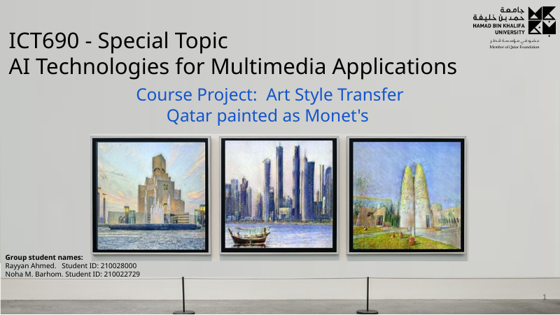

## Project question

**How might Claude Monet have rendered scenes from Qatar?**

The project connected generative image modeling with Qatar's cultural landscape. It examined whether an image-translation model could preserve the identity and structure of local landmarks while transferring Monet-like characteristics such as light, color, texture, brushstrokes, soft forms, and reduced reliance on hard outlines.

Potential applications included stylized visual content for Qatar landmarks, art creation, cultural storytelling, museum experiences, high-resolution visual production, and video stylization.

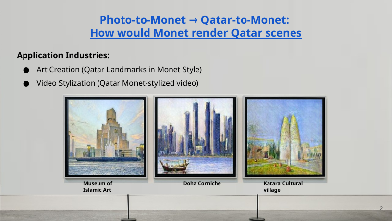

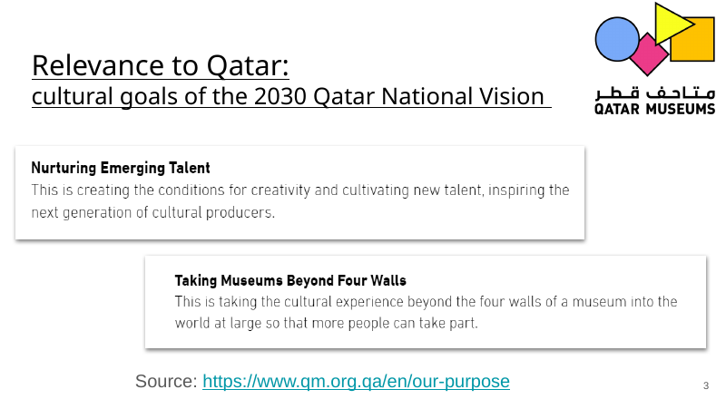

## Related approaches reviewed

The project reviewed three main families of style-transfer methods:

1. **Neural style transfer** — combines the content of one image with the visual style of another.
2. **Unpaired image-to-image translation** — learns mappings between two visual domains without paired images.
3. **Adaptive style transfer** — applies a learned or pretrained style representation to new content images.

CycleGAN was selected because the available photo and Monet datasets were **unpaired**. There were no Monet paintings and modern photographs depicting the same scenes or layouts.

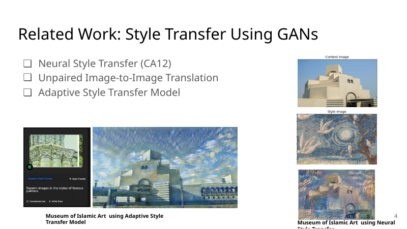

The project also reviewed characteristics of Monet's work, including his use of light, color, texture, and brushstroke, and the reduced use of hard lines.

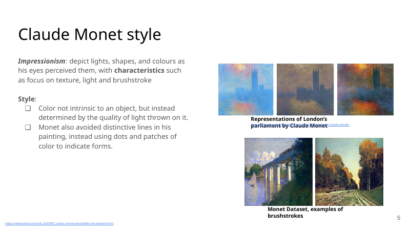

## Dataset

The project used the `monet2photo` dataset:

| Domain and split | Number of images |
|---|---:|
| Monet training images | 1,072 |
| Monet testing images | 121 |
| Photo training images | 6,287 |
| Photo testing images | 751 |

Images were processed at **256 × 256** resolution. Since the two domains contain independent images rather than matched pairs, cycle consistency was important for preserving source content after translation.

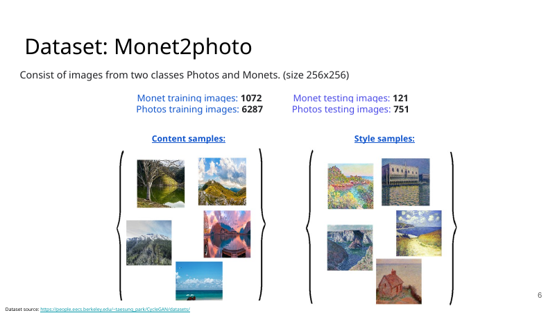

## Evaluation approach

The project used both qualitative and quantitative evaluation.

### Qualitative evaluation

Outputs were inspected for:

- preservation of scene content;
- Monet-like treatment of light and color;
- reduced hard edges;
- smoother brushstroke-like texture;
- preservation of landmark structure;
- consistency across lighting conditions.

### Quantitative evaluation

The project used **Fréchet Inception Distance (FID)** and compared:

- image quality;
- style similarity;
- training time per epoch;
- inference time per image;
- content preservation.

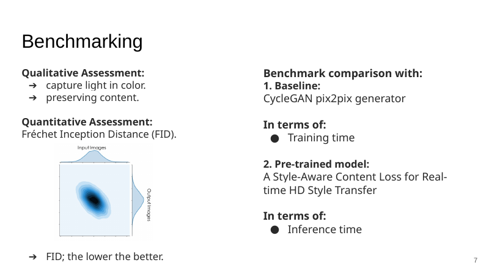

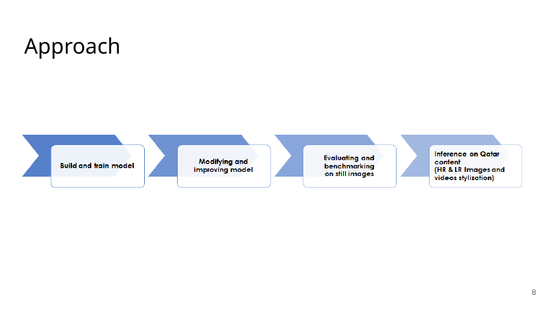

## Model architecture

CycleGAN learns two mappings:

- **Photo → Monet**
- **Monet → Photo**

It uses two generators, two discriminators, adversarial objectives, cycle-consistency loss, and identity loss.

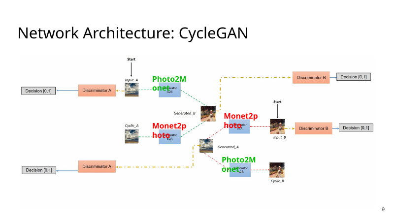

### ResNet generator

The project tested a ResNet-based generator rather than relying only on a U-Net-style mapping. Residual blocks were used to preserve scene content while transforming texture, color, and visual style.

The cycle-consistency objective helps prevent the Photo-to-Monet generator from disregarding the original scene. The translated image is mapped back to the photo domain, and the reconstruction is compared with the source image.

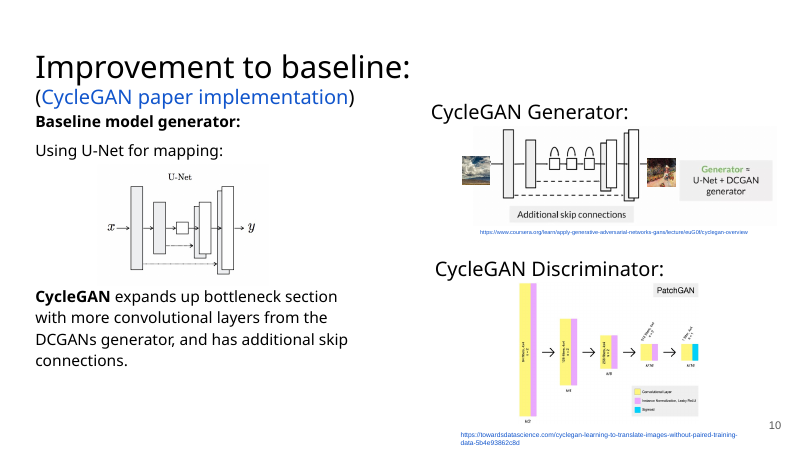

## Training workflow

The workflow included:

1. loading the Photo and Monet domains;
2. resizing, cropping, normalization, and augmentation;
3. training both generators and discriminators;
4. monitoring adversarial, cycle-consistency, and identity objectives;
5. testing learning-rate settings;
6. visually inspecting generated outputs;
7. calculating FID;
8. comparing model variants and alternative approaches;
9. applying selected models to Qatar scenes;
10. testing super-resolution and video stylization.

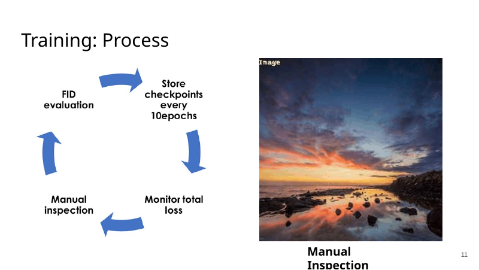

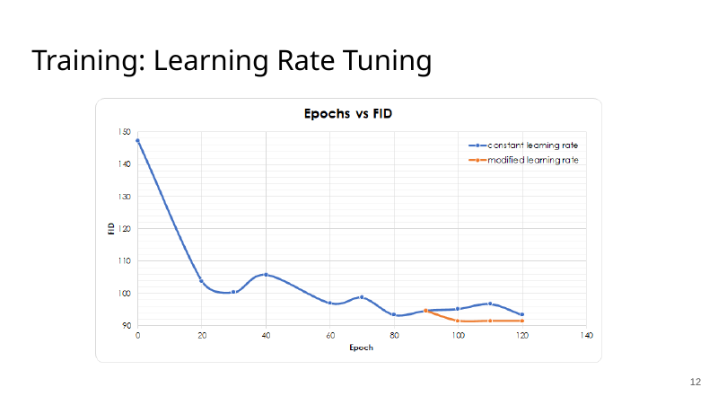

## Baseline comparison

The ResNet CycleGAN experiment was compared with a tested Pix2Pix-based baseline.

| Model | Monet-style FID on 751 test images | Average training time |
|---|---:|---:|
| Tested Pix2Pix-based baseline | 93.587 | 15 min/epoch |
| ResNet CycleGAN experiment | **91.478** | **7 min/epoch** |

The ResNet CycleGAN produced a lower FID in the reported experiment while reducing the measured average training time per epoch.


## Comparison with adaptive style transfer

The project compared the CycleGAN output with a pretrained adaptive style-transfer approach. The evaluation focused on capturing light through color, maintaining scene content, preserving the source of light, producing smoother brushstroke-like patterns, and inference speed.

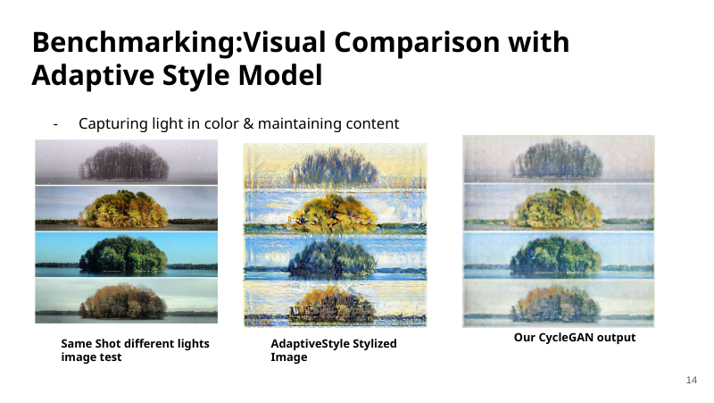

| Method | Reported single-image inference time |
|---|---:|
| Adaptive style-transfer model | 84 seconds |
| ResNet CycleGAN experiment | **0.822 seconds** |

These values reflect the original 2020 experimental environment and hardware.

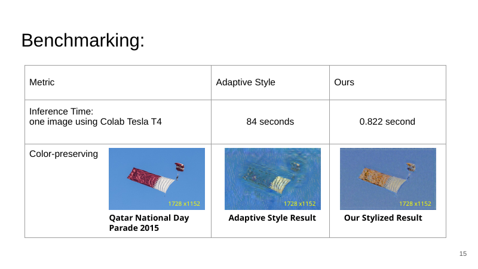

## Qatar-scene experiments

The model was applied to Qatar scenes to assess whether it could preserve recognizable local content while transferring the Monet domain.

### Katara Cultural Village

| Method | Image-quality FID | Monet-style FID |
|---|---:|---:|
| Adaptive style | 313.407 | 283.793 |
| ResNet CycleGAN experiment | **137.614** | 283.957 |

The quantitative evaluation used 13 high-resolution images for image-quality analysis and a 300-image test set for style-oriented comparison.

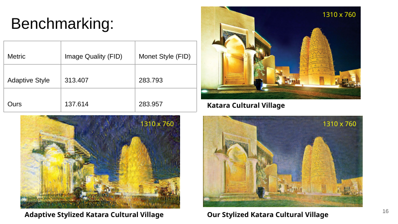

Other tested scenes included the Museum of Islamic Art, Doha Corniche, Banana Island, and Qatar National Day imagery.

## High-resolution image stylization

The original CycleGAN output resolution was 256 × 256. The project explored:

1. applying the trained model within a high-resolution workflow;
2. stylizing a low-resolution image and then using a pretrained image super-resolution model.

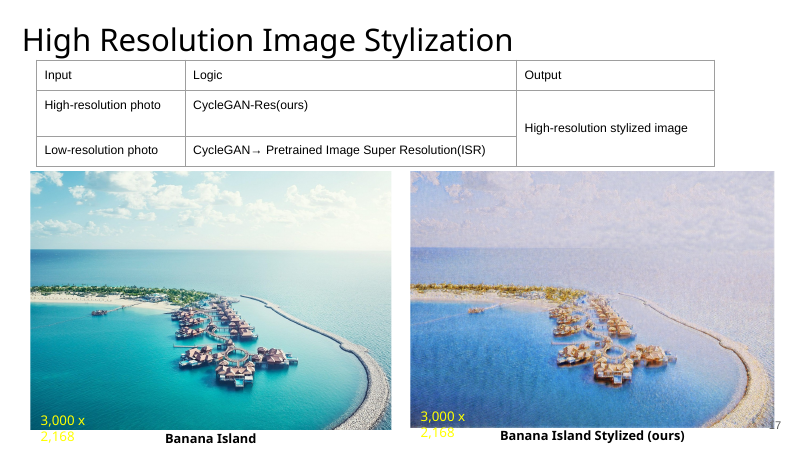

A selected Doha Corniche output was increased from **256 × 256 to 1024 × 1024** using pretrained image super-resolution.

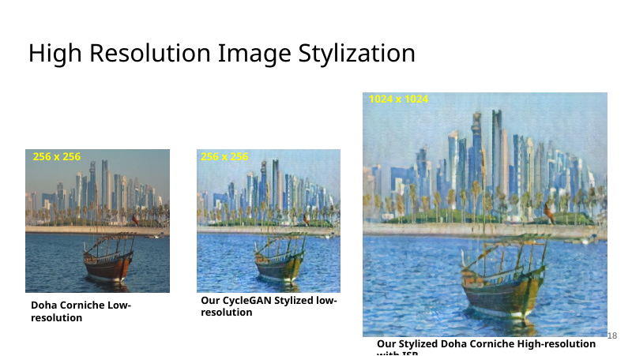

## Super-resolution and video stylization

The project also explored a high-resolution video-stylization workflow in which video frames could be processed by the style-transfer model and enhanced using super-resolution.

This was an exploratory extension rather than the primary benchmark.

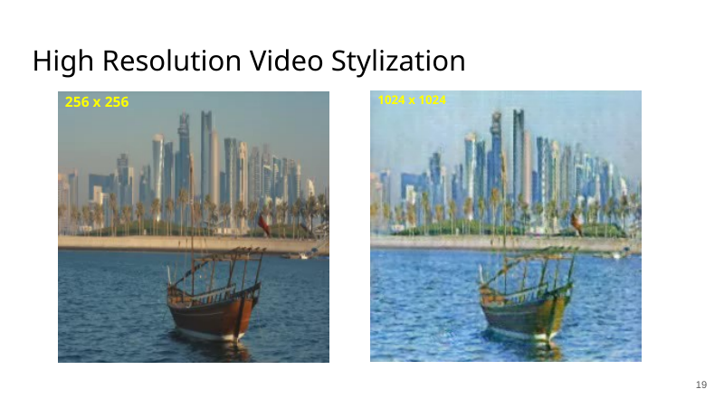

## Main findings

The original experiments indicated that:

- unpaired translation was suitable for the Photo and Monet domains;
- the ResNet generator preserved scene content while transferring texture and color;
- the tested ResNet CycleGAN achieved a modest FID improvement over the reported baseline;
- training and inference were faster in the reported comparisons;
- Qatar landmarks remained recognizable after stylization;
- super-resolution provided a practical path from 256 × 256 outputs to larger visual assets.

## Limitations

- The project was completed in 2020 using the software and hardware available at that time.
- The notebook depends on older TensorFlow packages and may require updates.
- FID values should be interpreted within the exact dataset, preprocessing, and implementation used.
- Visual style and content preservation were partly assessed through manual inspection.
- Video stylization and high-resolution generation were exploratory.
- The implementation predates modern diffusion-based image-generation systems.

## Repository structure

```text
qatar-to-monet-cyclegan/
├── README.md
├── notebooks/
│   └── Photo2Monet_resnet.ipynb
├── presentation/
│   └── Qatar_to_Monet_Project_Presentation.pdf
├── assets/
│   └── slides/
│       └── slide-01.png ... slide-20.png
├── requirements.txt
├── NOTICE.md
├── LICENSE
└── .gitignore
```

## Running the notebook

The notebook was created in Google Colab and uses packages from the 2020 TensorFlow ecosystem. It is preserved as the original project artifact and may require dependency changes in a current environment.

```bash
pip install tensorflow tensorflow-datasets tensorflow-addons matplotlib numpy
pip install git+https://github.com/tensorflow/examples.git
```

The original workflow mounts Google Drive for checkpoints and generated outputs. Update those paths before running.

## Technologies

- Python
- TensorFlow
- TensorFlow Datasets
- CycleGAN
- ResNet
- Generative adversarial networks
- Fréchet Inception Distance
- Image preprocessing
- Image super-resolution

## Acknowledgements and attribution

The implementation builds on the TensorFlow CycleGAN tutorial and the original CycleGAN research.

This was a group course project completed by **Rayyan Ahmed** and **Noha M. Barhom** for *ICT690 — AI Technologies for Multimedia Applications*.

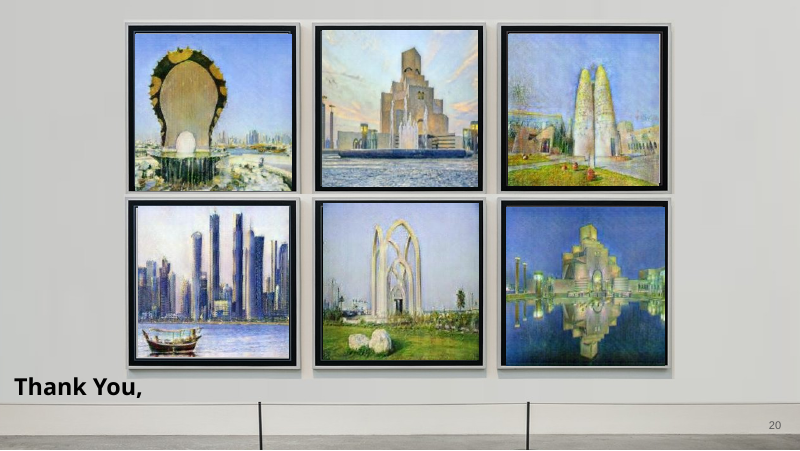
